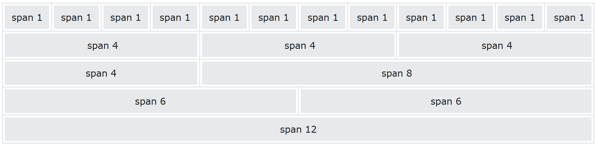

## The Grid System

Bootstrap's grid system is built with flexbox and allows up to 12 columns across the page.

If you do not want to use all 12 columns individually, you can group the columns together to create wider columns:



The grid system is responsive, and the columns will re-arrange automatically depending on the screen size.

Make sure that the sum adds up to 12 or fewer (it is not required that you use all 12 available columns).

## Grid Classes

The Bootstrap 5 grid system has six classes:

-   `.col-` (extra small devices - screen width less than 576px)
-   `.col-sm-` (small devices - screen width equal to or greater than 576px)
-   `.col-md-` (medium devices - screen width equal to or greater than 768px)
-   `.col-lg-` (large devices - screen width equal to or greater than 992px)
-   `.col-xl-` (xlarge devices - screen width equal to or greater than 1200px)
-   `.col-xxl-` (xxlarge devices - screen width equal to or greater than 1400px)

The classes above can be combined to create more dynamic and flexible layouts.

**Tip:** Each class scales up, so if you want to set the same widths for `sm` and `md`, you only need to specify `sm`.

___

## Basic Structure of a Bootstrap 5 Grid

The following is a basic structure of a Bootstrap 5 grid:
```html
<!-- Control the column width, and how they should appear on different devices -->
<div class="row">
  <div class="col-*-*"></div>
  <div class="col-*-*"></div>
  <div class="col-*-*"></div>
</div>

<!-- Or let Bootstrap automatically handle the layout -->
<div class="row">
  <div class="col"></div>
  <div class="col"></div>
  <div class="col"></div>
</div>
```
First example: create a row (`<div class="row">`). Then, add the desired number of columns (tags with appropriate `.col-*-*` classes). The first star (\*) represents the responsiveness: sm, md, lg, xl or xxl, while the second star represents a number, which should add up to 12 for each row.

Second example: instead of adding a number to each `col`, let bootstrap handle the layout, to create equal width columns: two `"col"` elements = 50% width to each col, while three cols = 33.33% width to each col. Four cols = 25% width, etc. You can also use `.col-sm|md|lg|xl|xxl` to make the columns responsive.


## Grid Options

The following table summarizes how the Bootstrap 5 grid system works across different screen sizes:

|   | Extra small (<576px) | Small (>=576px) | Medium (>=768px) | Large (>=992px) | Extra Large (>=1200px) | XXL (>=1400px) |
| --- | --- | --- | --- | --- | --- | --- |
| **Class prefix** | `.col-` | `.col-sm-` | `.col-md-` | `.col-lg-` | `.col-xl-` | `.col-xxl-` |
| **Grid behaviour** | Horizontal at all times | Collapsed to start, horizontal above breakpoints | Collapsed to start, horizontal above breakpoints | Collapsed to start, horizontal above breakpoints | Collapsed to start, horizontal above breakpoints | Collapsed to start, horizontal above breakpoints |
| **Container width** | None (auto) | 540px | 720px | 960px | 1140px | 1320px |
| **Suitable for** | Portrait phones | Landscape phones | Tablets | Laptops | Laptops and Desktops | Laptops and Desktops |
| **\# of columns** | 12 | 12 | 12 | 12 | 12 | 12 |
| **Gutter width** | 1.5rem (.75rem on each side of a column) | 1.5rem (.75rem on each side of a column) | 1.5rem (.75rem on each side of a column) | 1.5rem (.75rem on each side of a column) | 1.5rem (.75rem on each side of a column) | 1.5rem (.75rem on each side of a column) |
| **Nestable** | Yes | Yes | Yes | Yes | Yes | Yes |
| **Offsets** | Yes | Yes | Yes | Yes | Yes | Yes |
| **Column ordering** | Yes | Yes | Yes | Yes | Yes | Yes |


# Stacked-to-horizontal

Let's create a basic grid system that starts out stacked on extra small devices, before becoming horizontal on larger devices.

The following example shows a simple "stacked-to-horizontal" two-column layout, meaning it will result in a 50%/50% split on all screens, except for extra small screens, which it will automatically stack (100%):
```html
<div class="container-fluid">
  <div class="row">
    <div class="col-sm-6 bg-primary">
      <p>Box 1</p>
    </div>
    <div class="col-sm-6 bg-dark">
      <p>Box 2</p>
    </div>
  </div>
</div>
```

**Tip:** The numbers in the `.col-sm-*` classes indicates how many columns the div should span (out of 12). So, `.col-sm-1` spans 1 column, `.col-sm-4` spans 4 columns, `.col-sm-6` spans 6 columns, etc.  
  
**Note:** Make sure that the sum adds up to 12 or fewer (it is not required that you use all 12 available columns):

**Tip:** You can turn any **full-width** layout into a **fixed-width** **responsive** layout, by changing the `.container-fluid` class to `.container`:

### Example: Responsive Container
```html
<div class="container">
  <div class="row">
    <div class="col-sm-6">
      <p>Box 1</p>
    </div>
    <div class="col-sm-6">
      <p>Box 1</p>
    </div>
  </div>
</div>
```

## Auto Layout Columns

In Bootstrap 5, there is an easy way to create equal width columns for all devices: just remove the number from `.col-_size_-*` and only use the `.col-_size_` class on a specified number of **col elements**. Bootstrap will recognize how many columns there are, and each column will get the same width. The _size_ classes (sm, md, etc.) determines **when** the columns should be responsive:
```html
<!-- Two columns: 50% width on all screens, except for extra small (100% width) -->
<div class="row">
  <div class="col-sm">1 of 2</div>
  <div class="col-sm">2 of 2</div>
</div>

<!-- Four columns: 25% width on all screens, except for extra small (100% width)-->
<div class="row">
  <div class="col-sm">1 of 4</div>
  <div class="col-sm">2 of 4</div>
  <div class="col-sm">3 of 4</div>
  <div class="col-sm">4 of 4</div>
</div>
```

## Extra Small Grid Example

|   | XSmall | Small | Medium | Large | Extra Large | XXL |
| --- | --- | --- | --- | --- | --- | --- |
| **Class prefix** | `.col-` | `.col-sm-` | `.col-md-` | `.col-lg-` | `.col-xl-` | `.col-xxl-` |
| **Screen width** | <576px | \>=576px | \>=768px | \>=992px | \>=1200px | \>=1400px |

Assume we have a simple layout with two columns. We want the columns to split 25%/75% for **ALL** devices.

We will add the following classes to our two columns:
```html
<div class="col-3">....</div>
<div class="col-9">....</div>
```

The following example will result in a 25%/75% split on all devices (extra small, small, medium, large, xlarge and xxlarge).
```html
<div class="container-fluid">
  <div class="row">
    <div class="col-3 bg-primary">
      <p>Lorem ipsum...</p>
    </div>
    <div class="col-9 bg-dark">
      <p>Sed ut perspiciatis...</p>
    </div>
  </div>
</div>
```

**Note:** Make sure that the sum adds up to 12 or fewer (it is not required that you use all 12 available columns):

For a 33.3%/66.6% split, you would use `.col-4` and `.col-8` (and for a 50%/50% split, you would use `.col-6` and `.col-6`):
```html
<!-- 33.3%/66.6% split -->
<div class="container-fluid">
  <div class="row">
    <div class="col-4 bg-primary">
      <p>Lorem ipsum...</p>
    </div>
    <div class="col-8 bg-dark">
      <p>Sed ut perspiciatis...</p>
    </div>
  </div>
</div>

<!-- 50%/50% split -->
<div class="container-fluid">
  <div class="row">
    <div class="col-6 bg-primary">
      <p>Lorem ipsum...</p>
    </div>
    <div class="col-6 bg-dark">
      <p>Sed ut perspiciatis...</p>
    </div>
  </div>
</div>
```

## Auto Layout Columns

In Bootstrap 5, there is an easy way to create **equal width columns** for all devices: just remove the number from `.col-*` and only use the `.col` class on a specified number of **col elements**. Bootstrap will recognize how many columns there are, and each column will get the same width:
```html
<!-- Two columns: 50% width-->
<div class="row">
  <div class="col">1 of 2</div>
  <div class="col">2 of 2</div>
</div>

<!-- Four columns: 25% width-->
<div class="row">
  <div class="col">1 of 4</div>
  <div class="col">2 of 4</div>
  <div class="col">3 of 4</div>
  <div class="col">4 of 4</div>
</div>
```

The next chapter shows how to add a different split percent for small devices.

# Small Grid Example

|   | XSmall | Small | Medium | Large | Extra Large | XXL |
| --- | --- | --- | --- | --- | --- | --- |
| **Class prefix** | `.col-` | `.col-sm-` | `.col-md-` | `.col-lg-` | `.col-xl-` | `.col-xxl-` |
| **Screen width** | <576px | \>=576px | \>=768px | \>=992px | \>=1200px | \>=1400px |

Assume we have a simple layout with two columns. We want the columns to be split 25%/75% for small devices.

Small devices are defined as having a screen width from **576 pixels to 767 pixels**.

For small devices we will use the `.col-sm-*` classes.

We will add the following classes to our two columns:
```html
<div class="col-sm-3">....</div>
<div class="col-sm-9">....</div>
```

The following example will result in a 25%/75% split on small (and medium, large, xlarge and xxlarge) devices. On extra small devices, it will automatically stack (100%):
```html
<div class="container-fluid">
  <div class="row">
    <div class="col-sm-3 bg-primary">
      <p>Lorem ipsum...</p>
    </div>
    <div class="col-sm-9 bg-dark">
      <p>Sed ut perspiciatis...</p>
    </div>
  </div>
</div>
```

**Note:** Make sure that the sum adds up to 12 or fewer (it is not required that you use all 12 available columns):

For a 33.3%/66.6% split, you would use `.col-sm-4` and `.col-sm-8` (and for a 50%/50% split, you would use `.col-sm-6` and `.col-sm-6`):

.col-sm-4

.col-sm-8

  

.col-sm-6

.col-sm-6

### Example

<!-- 33.3/66.6% split: -->  
<div class\="container-fluid"\>  
  <div class\="row"\>  
    <div class\="col-sm-4 bg-primary"\>  
      <p\>Lorem ipsum...</p\>  
    </div\>  
    <div class\="col-sm-8 bg-dark"\>  
      <p\>Sed ut perspiciatis...</p\>  
    </div\>  
  </div\>  
</div\>  
  
<!-- 50%/50% split: -->  
<div class\="container-fluid"\>  
  <div class\="row"\>  
    <div class\="col-sm-6 bg-primary"\>  
      <p\>Lorem ipsum...</p\>  
    </div\>  
    <div class\="col-sm-6 bg-dark"\>  
      <p\>Sed ut perspiciatis...</p\>  
    </div\>  
  </div\>  
</div\>

[Try it Yourself »](https://www.w3schools.com/bootstrap5/bootstrap_grid_small.phptryit.asp?filename=trybs_grid_small2&stacked=h)

___

___

## Auto Layout Columns

In Bootstrap 5, there is an easy way to create equal width columns for all devices: just remove the number from `.col-sm-*` and only use the `.col-sm` class on a specified number of **col elements**. Bootstrap will recognize how many columns there are, and each column will get the same width.

If the screen size is **less than 576px**, the columns will stack horizontally:

<!-- Two columns: 50% width on all screens, except for extra small (100% width) -->  
<div class\="row"\>  
  <div class\="col-sm"\>1 of 2</div\>  
  <div class\="col-sm"\>2 of 2</div\>  
</div\>  
  
<!-- Four columns: 25% width on all screens, except for extra small (100% width)-->  
<div class\="row"\>  
  <div class\="col-sm"\>1 of 4</div\>  
  <div class\="col-sm"\>2 of 4</div\>  
  <div class\="col-sm"\>3 of 4</div\>  
  <div class\="col-sm"\>4 of 4</div\>  
</div\>

1 of 2

2 of 2

  

1 of 4

2 of 4

3 of 4

4 of 4

[Try it Yourself »](https://www.w3schools.com/bootstrap5/bootstrap_grid_small.phptryit.asp?filename=trybs_grid_small_auto&stacked=h)

The next chapter shows how to add a different split percent for medium devices.